<h1 align="center">Frankenstein</h1>

Конструктор мобильных приложений через готовые темплейты, настройку темплейтов и скринов. Билд осуществляется при помощи билд-системы, на выходе которого дается APK. Добавление новых элементов на страницу осуществляется при помощи перетаскивании темплейтов посредством DnD. Для удобства темплейт сразу преобразовывается в элемент, чтобы было видно, как элемент будет выглядеть.

Стэк технологий:

<ul>
    <li>React</li>
    <li>React dnd</li>
    <li>Styled components</li>
    <li>Mobx</li>
    <li>React hook form & yup</li>
    <li>Webpack</li>
    <li>Typescript</li>
</ul>

Некоторые скриншоты:

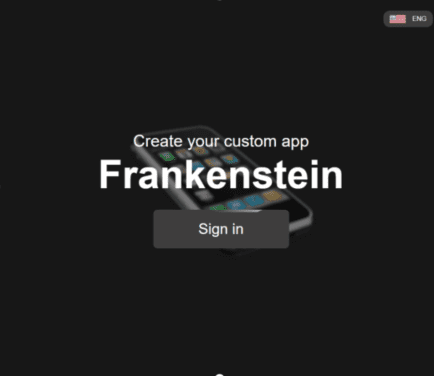
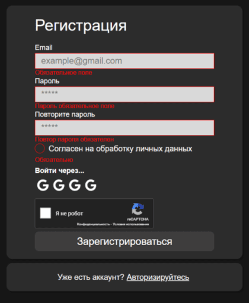
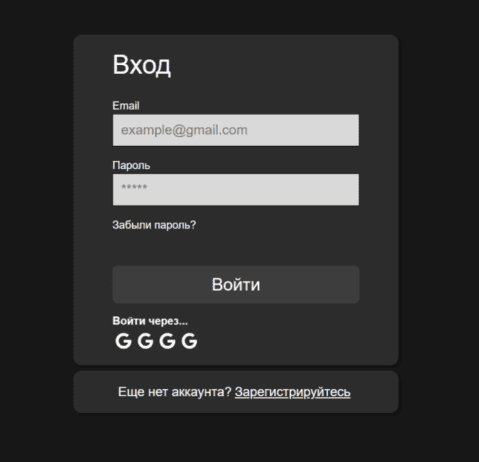
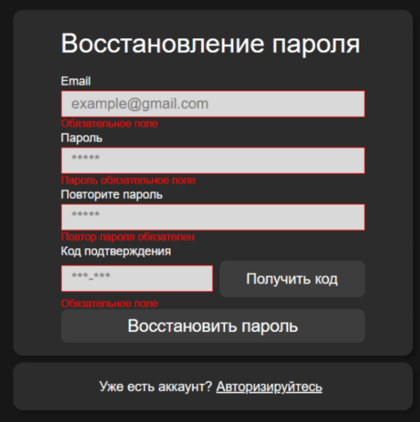
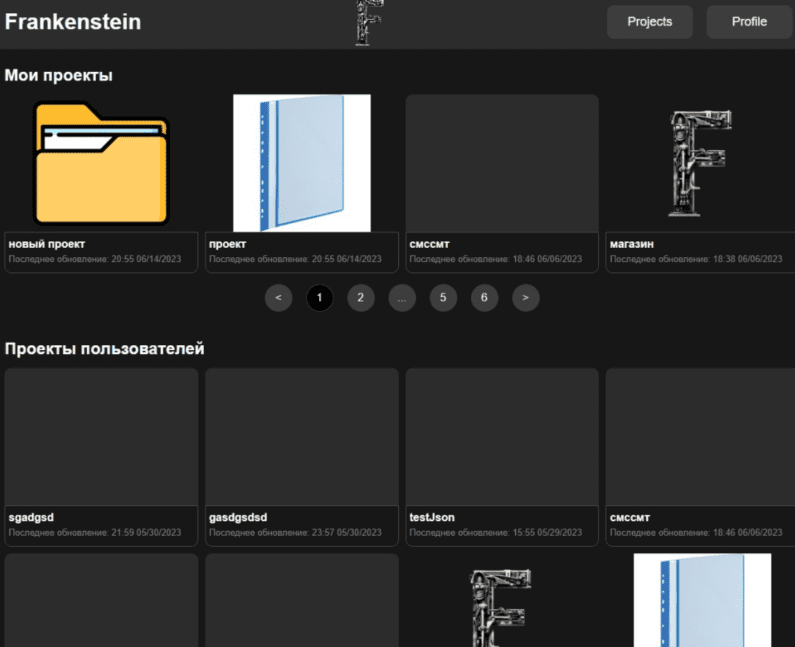
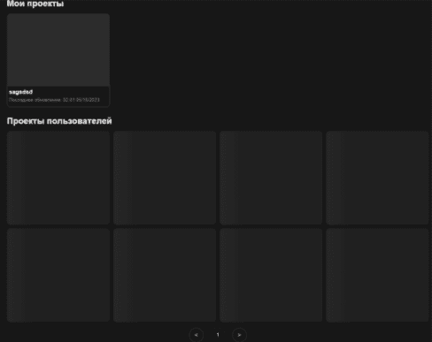
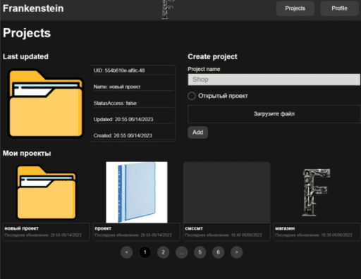
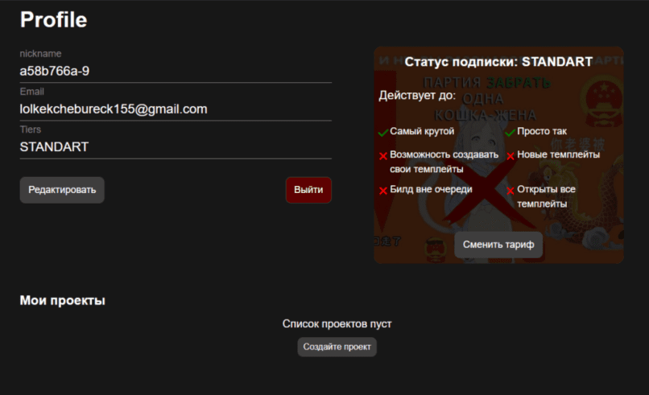

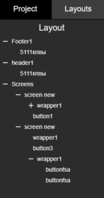
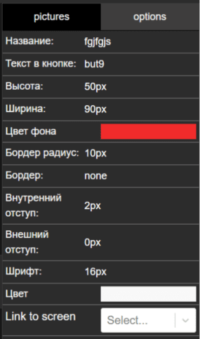
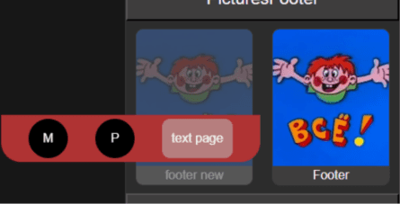
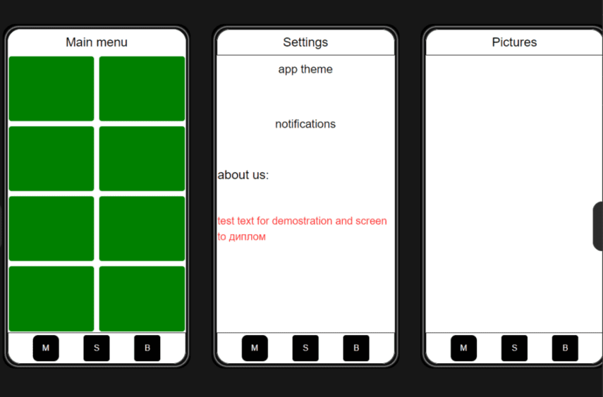
