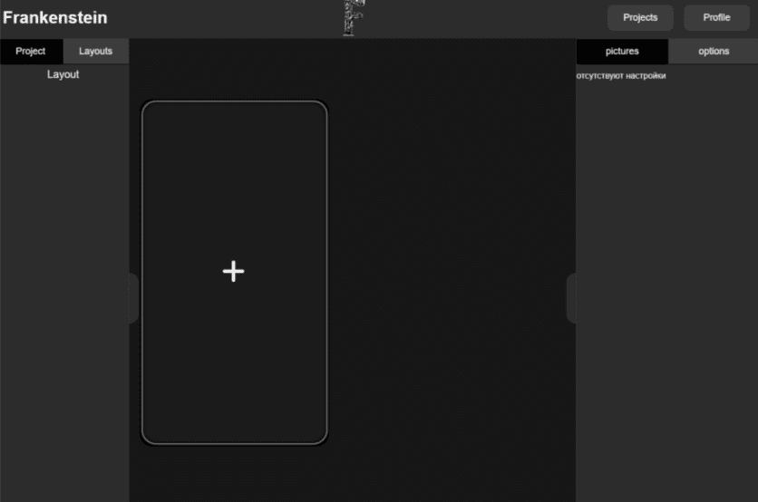

<h1 align="center">Frankenstein</h1>

Конструктор мобильных приложений

Стэк технологий:

<ul>
    <li>React</li>
    <li>React dnd</li>
    <li>Styled components</li>
    <li>Mobx</li>
    <li>React hook form & yup</li>
    <li>Webpack</li>
    <li>Typescript</li>
</ul>

Некоторые скриншоты:

